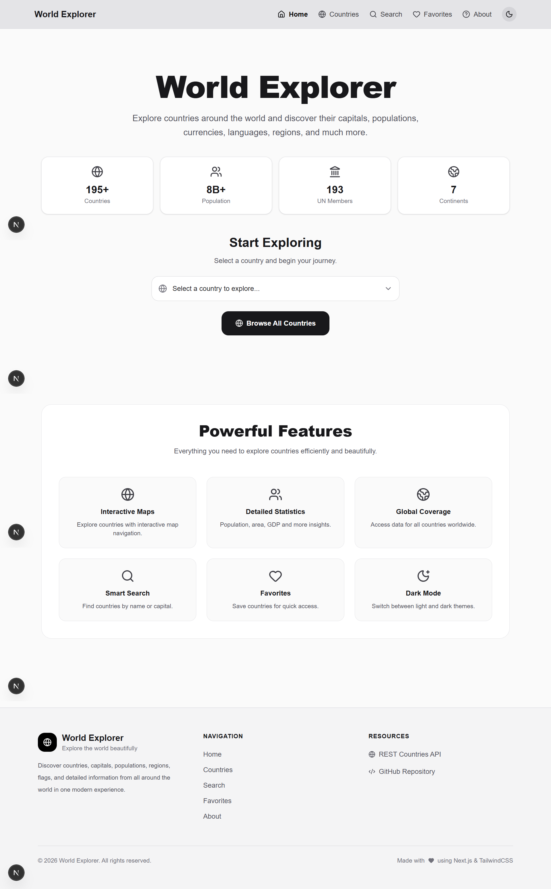
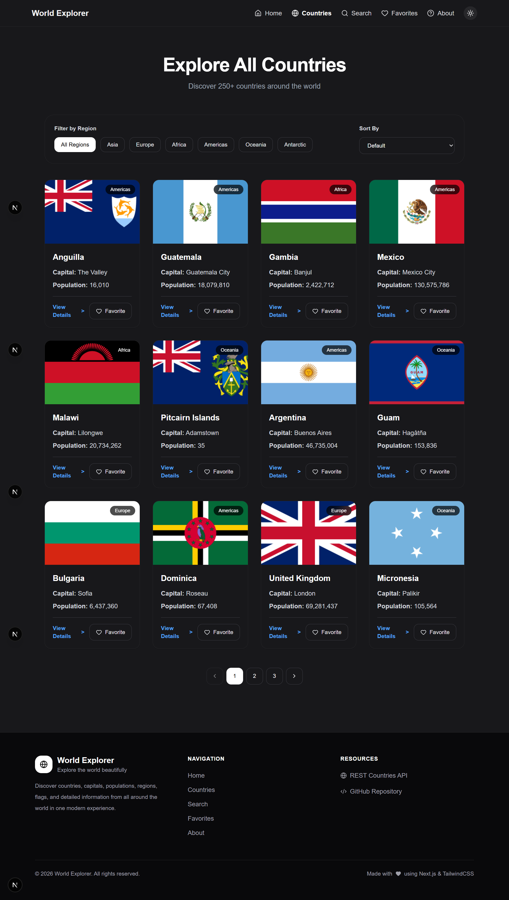
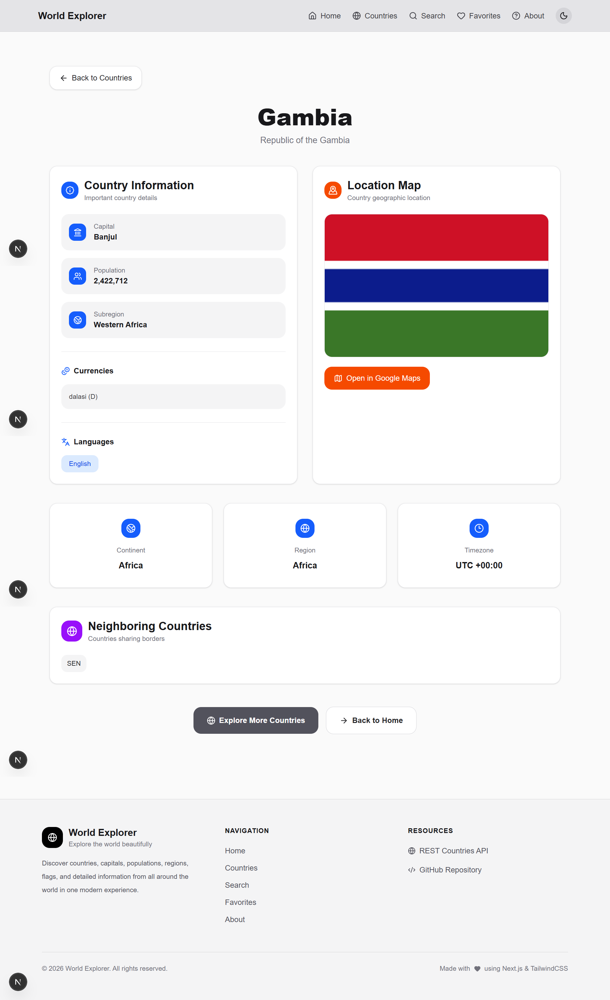
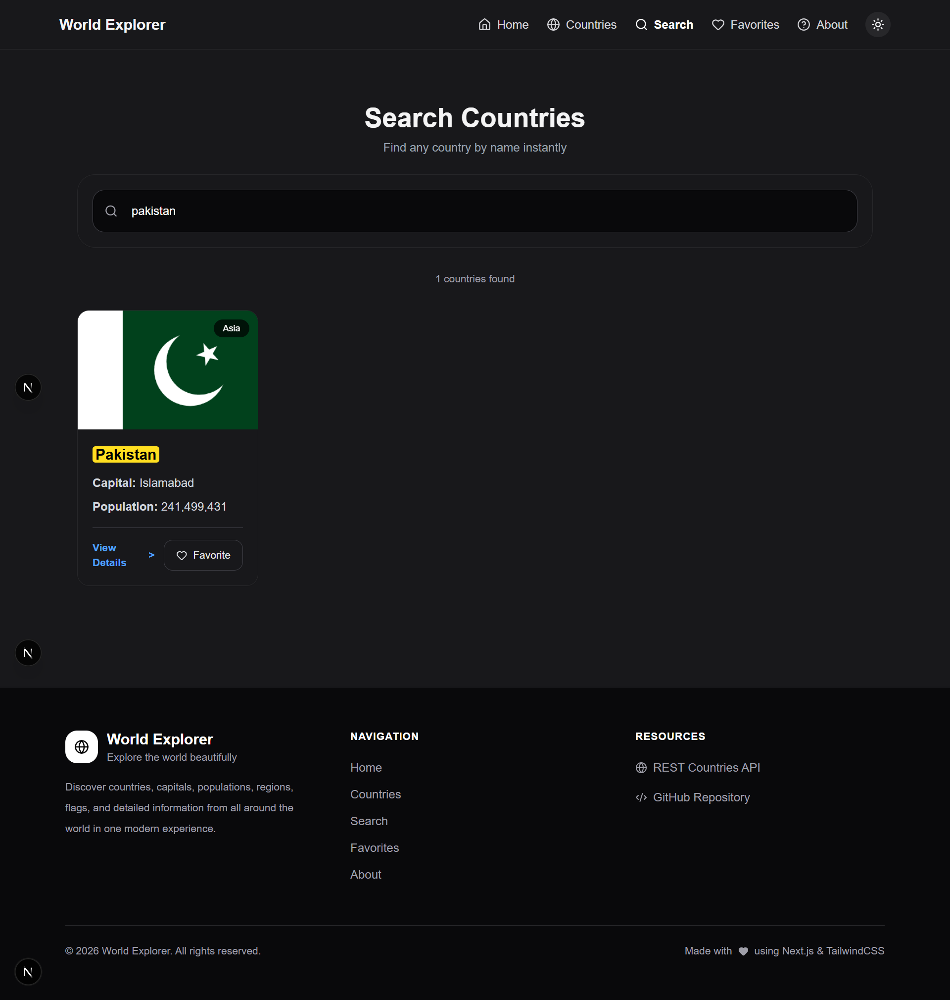
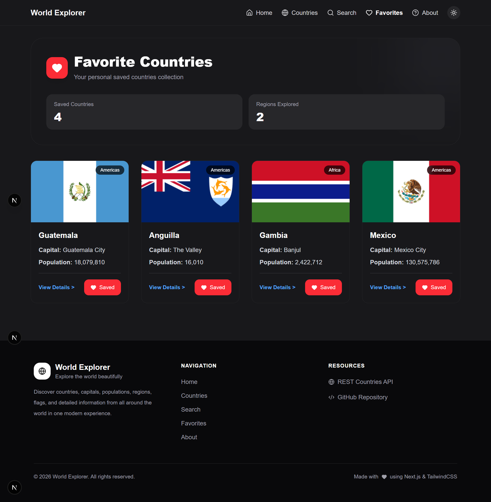
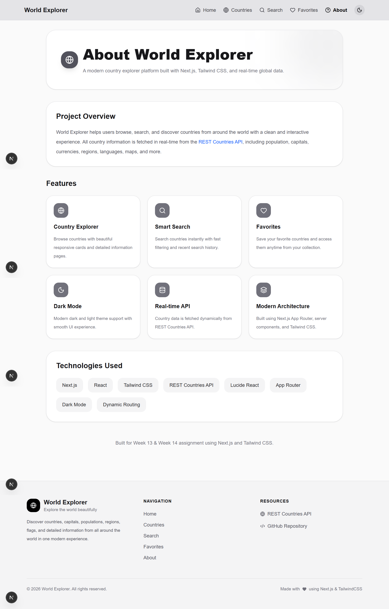

World Explorer

World Explorer is a modern and responsive Next.js application that allows users to explore countries around the world using real-time API data.

Users can browse countries, search by country name, view detailed country information, save favorite countries, switch between dark and light mode, and explore global data through a clean and interactive interface.

---

Core Features

- Next.js App Router
- File-based Routing
- Shared Layouts
- Dynamic Routes
- Server Components
- Client Components
- Real API Data Fetching
- Static Rendering & Caching
- Dynamic Rendering
- Responsive Design
- Mobile Navigation
- Search Functionality

---

Bonus Features

- Dark Mode Toggle
- Favorite Countries System
- Loading Page ("loading.js")
- Custom Responsive Navbar
- Dynamic Country Metadata
- Improved UI/UX Design
- Country Sorting & Filtering
- Hover Effects & Smooth Transitions
- Google Maps Integration

---

Pages

Home Page "/"

- Hero section
- Navigation links
- Statistics cards
- Country selector
- Explore countries button
- Responsive landing design

---

Countries Page "/countries"

- Displays countries from REST Countries API
- Country cards with:
  - Flag
  - Name
  - Capital
  - Region
  - Population
- View Details button
- Cached static rendering using:

cache: "force-cache"

---

Country Details Page "/countries/[id]"

Displays full country information including:

- Flag
- Official Name
- Capital
- Region
- Subregion
- Population
- Languages
- Currencies
- Time Zones
- Google Maps Link
- Back Button

Dynamic rendering using:

cache: "no-store"

---

Search Page "/search"

- Client-side country search
- Real-time filtering
- Built with:
  - "useState"
  - "useEffect"
  - Client Components

---

About Page "/about"

Explains:

- Project purpose
- API usage
- Next.js concepts practiced

---

Components

Navbar

Includes navigation links:

- Home
- Countries
- Search
- Favorites
- About

Responsive mobile menu included.

---

Footer

Displayed on all pages.

---

CountryCard

Reusable component displaying:

- Country flag
- Name
- Capital
- Region
- Population
- Details button

---

CountrySearch

Client component for searching countries.

---

ThemeToggle

Allows switching between:

- Light Mode
- Dark Mode

Theme preference is stored using "localStorage".

---

Technologies Used

- Next.js 16
- React
- Tailwind CSS
- Lucide React Icons
- REST Countries API

---

API Used

REST Countries API

https://restcountries.com/v3.1/all

Single country example:

https://restcountries.com/v3.1/alpha/AFG

---

Folder Structure
world-explorer/
│
├── app/
│   ├── layout.js
│   ├── page.js
│   ├── loading.js
│   ├── not-found.js
│   ├── globals.css
│   │
│   ├── about/
│   │   └── page.js
│   │
│   ├── countries/
│   │   ├── page.js
│   │   ├── loading.js
│   │   ├── CountriesClient.js
│   │   │
│   │   └── [id]/
│   │       ├── page.js
│   │       ├── loading.js
│   │       └── not-found.js
│   │
│   ├── search/
│   │   └── page.js
│   │
│   └── favorites/
│       └── page.js
│       └── favoriteClients.js
│
├── components/
│   ├── layout/
│   │   ├── Navbar.jsx
│   │   ├── Footer.jsx
│   │   └── ThemeToggle.jsx
│   │
│   ├── country/
│   │   ├── CountriesSkeleton.jsx
│   │   ├── CountryCard.jsx
│   │   ├── CountryGrid.jsx
│   │   ├── CountryDetails.jsx
│   │   ├── CountrySearch.jsx
│   │   ├── RegionFilter.jsx
│   │   ├── SortSelect.jsx
│   │   └── FavoriteButton.jsx
│   │
│   ├── ui/
│   │   ├── Loader.jsx
│   │   ├── EmptyState.jsx
│   │   ├── ErrorMessage.jsx
│   │   └── BackButton.jsx
│   │
│   └── providers/
│       └── ThemeProvider.jsx
│
├── context/
│   └── FavoritesContext.jsx
│
├── lib/
│   ├── api.js
│   ├── formatters.js
│   └── constants.js
│
├── public/
│   ├── hero-image.jpg
│   ├── world-map.svg
│   └── favicon.ico
│
├── .gitignore
├── jsconfig.json
├── next.config.js
├── package.json
├── postcss.config.js
└── README.md

---

Run Locally

Install dependencies:

npm install

Start development server:

npm run dev

Open:

http://localhost:3000

---

What I Learned

Through this project I practiced:

- Building full applications with Next.js App Router
- Dynamic routing
- Data fetching with async/await
- Server vs Client Components
- Caching strategies
- Responsive UI design
- Component reusability
- State management with Context API
- Theme handling in React
- API integration

---

Screenshots

home

 
countries

 

details

 

search

 

favorites

 

about

---

